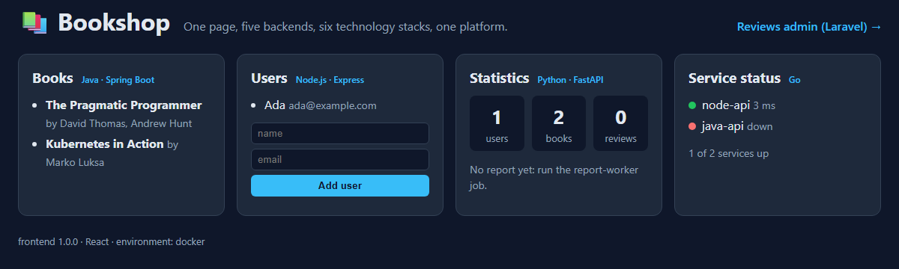

# frontend · React 19 + Vite, served by nginx

> Part of the Bookshop platform ([service contract](../../docs/CONTRACT.md)). Time: 30 minutes.
> Run every command from the repository root.

<!-- test-run: docker rm -f frontend fake-books frontend-wrong-port frontend-wrong-base >/dev/null 2>&1 || true; docker network rm frontend-test >/dev/null 2>&1 || true -->

## What is it?

**React** is a JavaScript library for building user interfaces out of components. **Vite** is the build tool: during
development it runs a fast dev server with hot reload, for production it bundles the code into a few static files.

The important point for deployment: **a React application runs in the browser, not in the container.** The container's
only job is to hand the browser a few files (`index.html`, one JavaScript file, one CSS file). That is why the
production image contains nginx and those files, and no Node.js at all.

```text
 build time (in the image build)            run time
 ┌─────────────────────────────┐            ┌──────────────────────────────┐        ┌──────────────────────┐
 │ node:24-alpine              │  dist/     │ nginx (unprivileged), :8080  │  HTTP  │ the browser runs     │
 │ npm ci, npm run build  ─────┼──────────► │ serves index.html, JS, CSS   ├──────► │ React; it calls      │
 │ (Vite bundles the JSX)      │            │ proxies /api/* (Compose)     │        │ /api/books, /api/... │
 └─────────────────────────────┘            └──────────────────────────────┘        └──────────────────────┘
```

## What does the application do?

One page, four panels, each fed by a different backend through a relative URL:

| Panel | Request | Answered by |
|---|---|---|
| Books | `GET /api/books` | `java-api` (Java, Spring Boot) |
| Users (+ a small "add user" form) | `GET/POST /api/users` | `node-api` (Node.js, Express) |
| Statistics | `GET /api/stats` | `python-api` (Python, FastAPI) |
| Service status | `GET /api/status` | `go-status` (Go) |

Plus a "Reviews admin" link to the Laravel application, whose address comes from runtime configuration. When a backend
does not answer, its panel says so (`java-api unreachable: HTTP 502`), which makes failures visible instead of an empty
page. Here it is with stand-in data (the real data arrives in the [Compose lesson](../../compose/README.md)):



| File | Purpose |
|---|---|
| `src/App.jsx`, `src/useApi.js`, `src/styles.css` | the page, a small fetch helper, the styles |
| `index.html`, `vite.config.js`, `package.json`, `package-lock.json` | Vite entry point, build and dev-server settings, exact dependency versions |
| `nginx/default.conf.template` | nginx configuration: the app, `/health`, `/config.js`, the `/api/*` proxy |
| `nginx/40-config-js.sh` | writes `/config.js` from environment variables when the container starts |
| `Dockerfile`, `.dockerignore` | the two-stage image build |

### Build-time vs. run-time configuration

Everything in the JavaScript bundle is fixed when `npm run build` runs: Vite replaces values like `__APP_VERSION__`
with text. If the admin URL were baked in the same way, you would need a different image for Compose, Kubernetes and
production. Instead the page loads `/config.js` before the app. The container writes that file at start from the
environment variables `ADMIN_URL` and `APP_ENV`, so **one image** runs everywhere. Rule of thumb: only values that never
change between environments (like the version) belong in the build; everything else is configuration at run time.
And never put secrets in either: everything the browser receives, every user can read.

## How do I run it locally?

With Node.js 24 installed, the dev server runs on port 5173 with hot reload (edit a file, the browser updates):

<!-- test: skip -->
```bash
cd applications/frontend
npm install
npm run dev
```

`vite.config.js` forwards `/api/*` to the APIs that Docker Compose publishes on your computer. The dev server is a
development tool: it compiles on the fly, serves unminified code and has no hardening. **Production uses the build
output, served by a real web server**, which is what the image does.

| | Development server (`npm run dev`) | Production build (`npm run build` + nginx) |
|---|---|---|
| what runs | Node.js + Vite, compiling on request | nginx serving static files |
| code | original modules, readable, source maps | bundled, minified, file names with a content hash |
| reload | instant (hot module replacement) | rebuild the image |
| size / speed | hundreds of MB of `node_modules` | about 250 KB of files |
| use it for | writing code | everything else |

## How do I build the Docker image?

<!-- test: timeout=900; contains=frontend:1.0.0 -->
```bash
docker build -t frontend:1.0.0 applications/frontend
```

The [Dockerfile](Dockerfile) has two stages:

| Line(s) | What happens | Why |
|---|---|---|
| `FROM node:24-alpine AS build` | stage 1 starts from Node.js 24 | the build needs Node.js and npm |
| `COPY package.json package-lock.json ./` + `RUN npm ci` | install exactly the locked dependency versions | copied before the source, so this slow layer is reused from the cache while only code changes |
| `COPY index.html vite.config.js ./`, `public`, `src` | the source | |
| `ARG APP_VERSION`, `ARG BASE_PATH` + `RUN npm run build -- --base=...` | Vite writes `dist/` | the version is shown in the footer; `BASE_PATH` is the URL path the app lives under |
| `FROM nginxinc/nginx-unprivileged:1.30.5-alpine` | stage 2 starts fresh from nginx | Node.js, `node_modules` and the source code are left behind |
| `ENV ... NODE_API_URL=http://node-api:3000 ...` | defaults for the run-time settings | overridable with `-e` / Compose / Kubernetes |
| `COPY nginx/default.conf.template /etc/nginx/templates/` | nginx config template | the image's entrypoint fills in `${VARIABLES}` at start |
| `COPY --chmod=755 nginx/40-config-js.sh /docker-entrypoint.d/` | start-up script | writes `/config.js` |
| `COPY --from=build /app/dist /usr/share/nginx/html` | **only the built files** cross from stage 1 | |

The base image runs nginx as the unprivileged user `nginx` (uid 101) on port **8080** (ports below 1024 need root).

How much the second stage saves: build stage 1 on its own and compare.

<!-- test: timeout=900; contains=frontend-build -->
```bash
docker build --target build -t frontend-build:1.0.0 applications/frontend
```

<!-- test: contains=frontend-build; output -->
```bash
docker images --format 'table {{.Repository}}:{{.Tag}}\t{{.Size}}' | grep -E '^(REPOSITORY|frontend)'
```

```text
REPOSITORY:TAG                        SIZE
frontend:1.0.0                        81.8MB
frontend-build:1.0.0                  334MB
```

The build stage carries Node.js and all of `node_modules`; the image you ship is nginx plus about 250 KB of files.

## How do I run the container?

```bash
docker run -d --name frontend -p 8081:8080 -e ADMIN_URL=http://localhost:8084/ frontend:1.0.0
```

The entrypoint prepares the configuration, then nginx starts:

<!-- test: retry=10; contains=40-config-js.sh; output -->
```bash
docker logs frontend 2>&1 | grep -E 'envsubst|config-js|local-resolvers'
```

```text
/docker-entrypoint.sh: Sourcing /docker-entrypoint.d/15-local-resolvers.envsh
/docker-entrypoint.sh: Launching /docker-entrypoint.d/20-envsubst-on-templates.sh
20-envsubst-on-templates.sh: Running envsubst on /etc/nginx/templates/default.conf.template to /etc/nginx/conf.d/default.conf
/docker-entrypoint.sh: Launching /docker-entrypoint.d/40-config-js.sh
40-config-js.sh: wrote /tmp/config.js (APP_ENV=production)
```

Open <http://localhost:8081> in a browser: the page loads, and every panel reports its backend as unreachable. That is
correct: the frontend runs alone.

## How does Docker Compose run it?

As the service `frontend`, on the same network as the APIs. Because Compose gives every service a DNS name, the
defaults (`http://node-api:3000`, `http://java-api:8080`, ...) just work, and nginx forwards `/api/*` to them. See the
[Compose lesson](../../compose/README.md).

## How does Kubernetes run it?

As a Deployment (two replicas of `frontend:1.0.0`) behind a Service named `frontend`. In Kubernetes the browser's
`/api/*` requests do not go through this nginx at all: the **Ingress** routes `/api/books` to `java-api`,
`/api/users` to `node-api` and so on, and sends everything else to `frontend`. `ADMIN_URL` and `APP_ENV` come from a
ConfigMap. See the [Kubernetes lessons](../../kubernetes/README.md).

## What Kubernetes resources are required?

| Resource | Why |
|---|---|
| Deployment `frontend` | runs and replaces the nginx Pods; probes on `/health` |
| Service `frontend` (ClusterIP, port 8080) | a stable name and address in front of the Pods |
| ConfigMap | `ADMIN_URL`, `APP_ENV` |
| Ingress (rule `/` → `frontend`) | brings browser traffic into the cluster |

No Secret and no volume: the frontend has no secrets (it must not have any) and stores nothing.

## How do I verify it?

<!-- test: retry=10; contains="status":"ok"; output -->
```bash
curl -s http://localhost:8081/health
```

```text
{"status":"ok","service":"frontend","version":"1.0.0"}
```

<!-- test: contains=APP_CONFIG; output -->
```bash
curl -s http://localhost:8081/config.js
```

```text
window.APP_CONFIG = { ADMIN_URL: "http://localhost:8084/", APP_ENV: "production" };
```

Any path that is not a file returns the app (`try_files ... /index.html`), so links like `/books/2` work after a reload:

<!-- test: contains=200; contains=text/html; output -->
```bash
curl -sI http://localhost:8081/books/2 | grep -iE '^(HTTP|content-type)'
```

```text
HTTP/1.1 200 OK
Content-Type: text/html
```

An API that does not exist gives a clear JSON error, not a hanging request:

<!-- test: contains=upstream unreachable; output -->
```bash
curl -s -w '\nHTTP %{http_code}\n' http://localhost:8081/api/books
```

```text
{"error":"upstream unreachable","path":"/api/books"}
HTTP 502
```

Now give it something to talk to. Before the real Java service exists, a **fake backend** (a few lines of Python that
always answer the same JSON) proves the proxy path end to end. Put both containers on one network and point
`JAVA_API_URL` at the fake:

```bash
docker network create frontend-test
docker run -d --name fake-books --network frontend-test python:3.14-alpine python -c '
import http.server, json
class H(http.server.BaseHTTPRequestHandler):
    def do_GET(self):
        body = json.dumps([{"id": 1, "title": "Fake Book", "author": "Test Data"}]).encode()
        self.send_response(200); self.send_header("Content-Type", "application/json"); self.end_headers(); self.wfile.write(body)
http.server.HTTPServer(("0.0.0.0", 8080), H).serve_forever()'
```

```bash
docker rm -f frontend
docker run -d --name frontend --network frontend-test -p 8081:8080 -e JAVA_API_URL=http://fake-books:8080 frontend:1.0.0
```

<!-- test: retry=15; contains=Fake Book; output -->
```bash
curl -s http://localhost:8081/api/books
```

```text
[{"id": 1, "title": "Fake Book", "author": "Test Data"}]
```

Browser → nginx (in `frontend`) → Docker's DNS finds `fake-books` → the fake answers. The Books panel now shows "Fake
Book". The same mechanism, with the real services, is the Compose lesson.

## How do I troubleshoot it?

**1 · "upstream unreachable" / a panel says `HTTP 502`.** nginx could not reach that API: the container is not
running, is on another network, or the URL variable is wrong. Check `docker ps`, `docker network inspect`, and the
value nginx actually uses:

<!-- test: contains=fake-books; output -->
```bash
docker exec frontend grep -A2 'location /api/books' /etc/nginx/conf.d/default.conf
```

```text
    location /api/books {
        set $upstream http://fake-books:8080;
        proxy_pass $upstream;
```

**2 · Nothing answers on the published port.** The classic: publishing the port nginx would use as root (80) instead of
the one this image listens on (8080).

```bash
docker run -d --name frontend-wrong-port -p 8082:80 frontend:1.0.0
```

<!-- test: fail; output -->
```bash
sleep 2; curl -sS --max-time 5 http://localhost:8082/health
```

```text
curl: (52) Empty reply from server
```

Docker accepts the connection on the host port and forwards it to port 80 in the container, where nothing listens, so
the reply is empty (on some systems: *connection reset*). `docker port frontend-wrong-port` shows the mapping
(`80/tcp -> 0.0.0.0:8082`); the right one is `-p 8082:8080`, because this image listens on 8080.

**3 · A blank white page.** The HTML arrives, but the JavaScript does not run. Typical cause: the app was built for a
different URL path. Build it for `/shop/` by mistake and serve it at `/`:

<!-- test: timeout=900; contains=frontend:wrong-base -->
```bash
docker build --build-arg BASE_PATH=/shop/ -t frontend:wrong-base applications/frontend
docker run -d --name frontend-wrong-base -p 8083:8080 frontend:wrong-base
```

<!-- test: retry=10; contains=text/html; output -->
```bash
ASSET=$(curl -s http://localhost:8083/ | grep -o '/shop/assets/[^"]*\.js')
echo "the page loads: $ASSET"
curl -sI "http://localhost:8083$ASSET" | grep -iE '^(HTTP|content-type)'
```

```text
the page loads: /shop/assets/index-D3AeDTfu.js
HTTP/1.1 200 OK
Content-Type: text/html
```

The page asks for `/shop/assets/...js`; that file does not exist at that path, so the SPA fallback answers with
`index.html`. The browser refuses to run HTML as a script (in its console: *Expected a JavaScript module script but the
server responded with a MIME type of "text/html"*) and the page stays white. Lesson: when a page is blank, open the
browser's developer tools, Network tab, and look at the **content type** of the JavaScript file. The fix is to build
with the path the app is actually served under (`BASE_PATH=/`, the default).

## How do I clean it up?

```text
⚠️ DESTRUCTIVE COMMAND · removes the test containers, the test network and the test images.
```

<!-- test: contains=frontend-test -->
```bash
docker rm -f frontend fake-books frontend-wrong-port frontend-wrong-base
docker network rm frontend-test
docker rmi frontend:wrong-base frontend-build:1.0.0
```

Keep `frontend:1.0.0`: the Compose and Kubernetes lessons use it.

## Practical challenge

**Task.** The support team wants their e-mail address in the page footer, different per environment.

**Requirements**
1. A new runtime setting `SUPPORT_EMAIL`; the footer shows `support: <address>` when it is set and nothing when not.
2. Changing the address must **not** need a new image: `docker run -e SUPPORT_EMAIL=...` is enough.
3. The image is tagged `frontend:1.1.0`.

**Hints**
- Which file is written at container start? Which object does the app read it from?
- Look at how `ADMIN_URL` travels from the environment to the page.

**Expected result.** `docker run -e SUPPORT_EMAIL=help@example.com ... frontend:1.1.0`, then
`curl -s localhost:8081/config.js` shows the address, and the footer displays it.

<details>
<summary>Solution</summary>

1. `nginx/40-config-js.sh`: add `SUPPORT_EMAIL: "$(esc "${SUPPORT_EMAIL:-}")"` to the object it writes.
2. `src/App.jsx`, in the footer: `{config.SUPPORT_EMAIL && <> · support: {config.SUPPORT_EMAIL}</>}`.
3. Rebuild once with a new version: `docker build --build-arg APP_VERSION=1.1.0 -t frontend:1.1.0 applications/frontend`.
4. Run it with and without `-e SUPPORT_EMAIL=...`: same image, different footer.

</details>

**Explanation.** The code change needs one rebuild (the app must know the setting exists); after that the *value* is
pure configuration. This is the same split Kubernetes makes: the image is the code, a ConfigMap holds the values.
