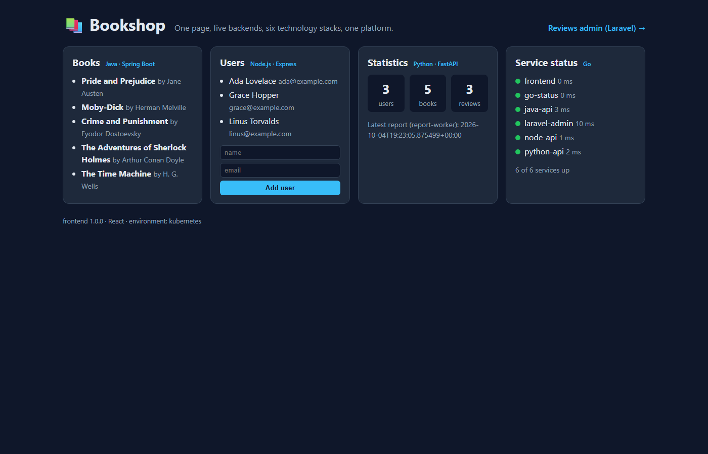

# 00 · Start here

> Goal: your tools work, you know your way around the repository, and you know why you can trust its outputs.
> Time: about 30 minutes.

## Your tools

Everything runs on your own computer. The [prerequisites table](../README.md#3-prerequisites) lists what to install:
Docker with Compose v2, kind, kubectl, Helm, Git, a bash shell, curl and Python 3. Each tool prints its version with
`--version` (kubectl with `kubectl version --client`). Compare with the versions used in the course
([README, section 6](../README.md#6-versions-checked-against-the-official-registries)): a newer patch version is fine.

Notice what is **not** on the list: Node.js, Python packages, Go, a JDK, PHP, Composer. Every build in this course
runs inside Docker. That is the first lesson of the course, before any command: a container image carries its own
toolchain, so the machine that builds and runs it only needs Docker.

Memory matters more than CPU here. The full platform on kind (seven services, two of them JVM and PHP, plus
PostgreSQL and the ingress controller) needs about 8 GB of free memory. If Docker Desktop has a memory limit, raise it
before chapter 04.

## Clone and tour

Clone the repository and open it in your editor. Spend ten minutes just looking:

```text
applications/    the seven applications: read one Dockerfile per stack, and one source file
compose/         one docker-compose.yml for everything
kubernetes/      one folder of YAML per application + the numbered lessons 00–14
docs/            15 concept lessons + CONTRACT.md
troubleshooting/ 12 failures                labs/   6 challenges with a new service
capstone/        deploy.sh, verify.sh, break.sh
tests/           mdrun.py, the runner that executes every lesson
```

## The platform you are going to deploy

Bookshop is one small product made of seven applications in six languages and frameworks. Look at the diagram in the
[README](../README.md) now, and keep it in mind for the whole course:

```text
 React UI ──► /api/users  Node.js    ──┐
          ──► /api/books  Java       ──┤
          ──► /api/stats  Python     ──┼──► PostgreSQL
          ──► /api/status Go (checks every service's /health)
 Laravel admin (nginx + PHP-FPM) ──────┘        ▲
 report-worker (plain JavaScript, a batch job) ─┘
```

Here is the screenshot of the finished product on Kubernetes, taken during a test run: the books come from Java,
the users from Node.js, the statistics from Python, the status board from Go.



## Why you can trust the outputs

Open [tests/README.md](../tests/README.md). Every ```bash block of every lesson is run by
[tests/mdrun.py](../tests/mdrun.py), on a real Docker engine and a real kind cluster, in CI on every change. The
```text block under a command is the output that command printed in such a run, written back by the runner. An HTML
comment above each block says what the output must contain, so a lesson that drifts from reality fails the build.

What this means for you:

- If your output looks different in a detail (an ID, a Pod name suffix, an age, a timestamp), that is normal.
- If it looks different in **substance** (an error where the lesson shows success), stop and investigate. That is
  either a difference in your setup or exactly the kind of failure the course teaches you to diagnose.

## Checkpoint

- [ ] Docker, kind, kubectl and Helm print their versions.
- [ ] You have the repository open and found the seven Dockerfiles.
- [ ] You can name the seven applications and their stacks without looking.
- [ ] You know what the ```text blocks under the commands are, and why they are trustworthy.

Next: [01 · The platform and the contract](01-the-platform-and-the-contract.md)
